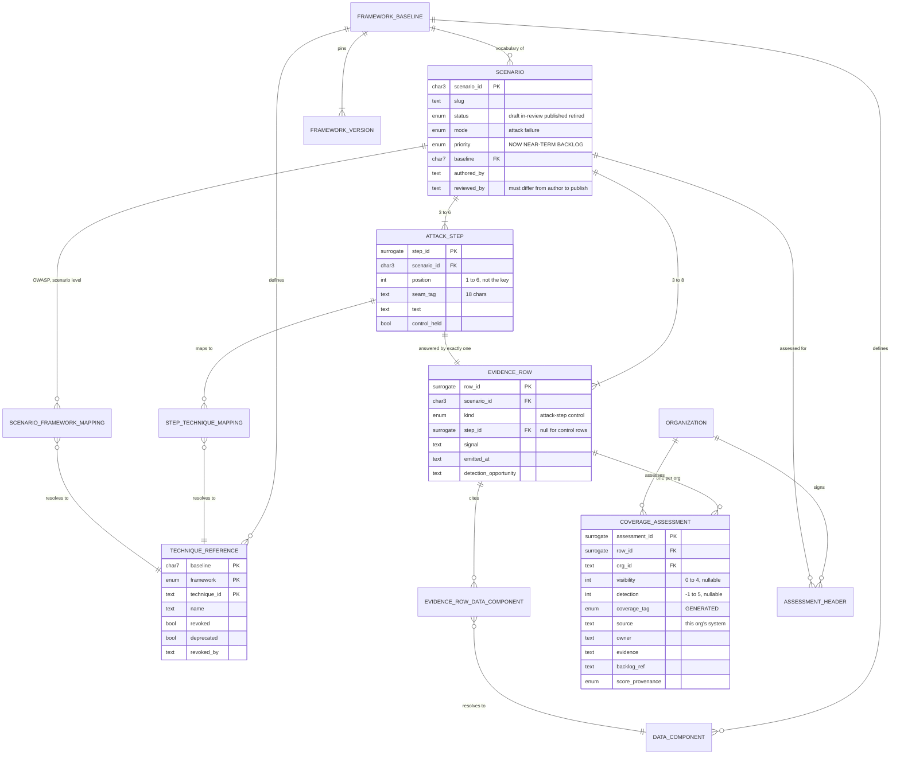

# Liszt: conceptual and logical data model

**Scope:** conceptual (entities and relationships in plain English) and logical (attributes, keys, cardinality). The physical model, table layout, indexes, partitioning, is not specified here.
**Authority:** the JSON Schemas under `schema/` and the tools that enforce them, both in `liszt/`. Where this document and a schema disagree, the schema wins and this document is wrong.

The document borrows its frame from the program's architecture diagram: what goes in, what is held, what is produced, where it goes, with the enforcement gate underneath.

---

## 1. What the system has to do

Liszt records attack and failure scenarios against AI systems, tests whether their claims are true, and produces a verdict on whether an attack would be seen. The verdict is the product. Everything else exists to make the verdict trustworthy.

A scenario is a story of three to six adversary moves. For each move, an evidence row says what the move would make observable and where. The people who own the systems then score each row on two questions: would we see it, on a scale of 0 to 4, and does anything alert on it, on a scale of minus 1 to 5. One rule turns the two numbers into a verdict for that row: Blind, nothing produces the signal; Collectable, the source exists but nothing is wired to it; Have, it is emitted and something is watching. The verdict is computed and never typed. That is the core claim: a coverage percentage on a slide can be authored, and this one cannot.

From the scored rows, three families of numbers come out for three audiences. Coverage, the share of steps instrumented, for engineering. Exposure, which urgent scenarios still have Blind steps, for risk. Maturity, whether the process itself is working, for the program office. A scenario can be entirely Blind and fully mature, which means the organization knows exactly what it cannot see, who owns each gap, and that it is funded. That is a feature.

A second loop checks the scores against reality. A test spec is generated from a scored scenario. A prediction of what a run will find is sealed before the run. An agent or a person executes the steps, records what was actually observed, and a scorer compares observation to prediction, row by row. The output is a calibration number for the process: whether the library is describing the estate or describing its authors' optimism. Where a scenario has no scores yet, a discovery run lets an agent propose first scores that a person accepts or rejects.

Every layer follows one pattern. A person writes a record. A tool derives something from it. The derived thing is never hand edited. Scores derive the coverage tag. Step mappings derive the scenario roll-up. Scenario plus baseline derive the spec. Spec plus sealed prediction plus observations derive the scorecard. A run derives proposed rescores, which a person accepts or rejects. Records derive the deck, the metrics, the published pages and the viewer. This decides which columns are generated and which are writable. A conventional CRUD design would quietly destroy it by making every field editable.

The corollary: nothing writes itself back. Model output is always a proposal. A proposed rescore is a row in its own table with a status, not an update statement.

### Scale

Twenty-one scenarios. Twelve use cases. Six incidents. About a hundred evidence rows. This is not a volume problem, and an architecture built to survive millions of rows would be the wrong architecture. The difficulty is correctness, derivation and integrity.

### What exists today

The model is not an invention. It is expressed as thirteen JSON Schemas, enforced by a validator that runs in continuous integration, and exercised by real records. One scenario, 021, runs the entire path end to end: validated, rolled up, snapshotted, its spec and prediction emitted, three runs scored against it, a discovery run proposing scores, and an import from the agentic platform. Every worked example is in `examples/`.

### Terms of art

- **Evidence row.** The program's word for what a step makes observable. The stored field and JSON key is still `telemetry`, kept for compatibility. Say evidence to a person; read `telemetry` in a file.
- **Baseline.** A named snapshot of every external framework's version, such as 2026.07. Every framework identifier in a record is expressed in exactly one baseline's vocabulary.
- **DeTT&CT.** The public scoring method the two scores come from. Visibility 0 to 4. Detection minus 1 to 5, where 0 means logged for forensics only, which is Collectable, not Have.
- **Overlay.** One organization's coverage assessment of one scenario, kept apart from the shared scenario so the library stays publishable while each organization's gaps stay its own.
- **Digest.** A sha256 hash of a file, used to bind a spec to its scenario, a prediction to its spec, and a run to its prediction, so a quiet edit after the fact is detectable.
- **Rung.** A level of the autonomy ladder. For test runs: lab-only, production-observe, production-active. For use cases: notify, assisted, autonomous. Only the lowest rung of each is enabled.

---

## 2. The spine

The spine is scenario, attack step, evidence row, coverage assessment, the framework references they point at, and the coverage derivation. Everything else in the model hangs off it.

### 2.1 Conceptual

A **Scenario** is the unit of the library. It has a title, a plain language summary, a classification (where it operates, how real it is, how urgent), a status that moves draft, in review, published, retired, and provenance (who wrote it, who reviewed it, when). It names exactly one **Framework Baseline**, and every framework identifier anywhere on it speaks that baseline's vocabulary.

A scenario has three to six **Attack Steps**, ordered. Each is one adversary move, one line of text, with a short tag saying where the move operates and, optionally, the framework techniques it maps to. The step number is its position in the chain, not its identity.

Every attack step has exactly one **Evidence Row** answering it, always, even when the answer is Blind. The row says what the step would make observable: the signal, the category of system that emits it, what you would alert on, and which data components it corresponds to. A scenario may also carry **Control Rows**, evidence rows for a standing condition rather than a move, which have no step and count in no coverage number.

An evidence row is shared across every organization that adopts the library. What differs per organization is whether that organization would see it. That is the **Coverage Assessment**: one per evidence row per organization, holding the two scores, the five quality dimensions, the exact source system in that organization's estate, the owner of the source, the evidence behind a Have, and the ticket behind a gap. The scenario record's own scores are the reference organization's assessment and sit in the same place as everyone else's. An **Assessment Header** records who assessed a scenario for an organization and when.

The **Coverage Tag** is derived from an assessment's two scores by one rule. It is stored as a cache and recomputed on every check.

Framework identifiers point at reference tables. A **Technique Reference** is one identifier in one framework at one baseline, with its name and whether it is current, deprecated, or revoked. A **Data Component** is an ATT&CK identifier for a kind of evidence. The scenario level **Framework Roll-up** is the union of the step level mappings and is derived, not authored, for the two MITRE frameworks. The two OWASP lists are assigned at scenario level, because their categories describe a scenario rather than a move.

### 2.2 The derivation rule

There is one rule, it exists in one place, and it is not configurable per organization, because that is what makes two organizations' numbers mean the same thing.

```
no scores, or either score missing   ->  unscored. Null. Absent from every number.
visibility == 0                      ->  Blind
visibility >= 1 and detection >= 1   ->  Have
otherwise (visibility >= 1, detection 0 or -1)  ->  Collectable
```

Visibility dominates: a detection score claimed over a source that does not exist is a scoring error, not a coverage state. Detection 0 means logged for forensics only, which is Collectable; treating it as Have is the single most attractive way to overstate coverage and the rule forbids it.

In PostgreSQL this is a generated column or a view. It is never a writable column.

### 2.3 Logical

Keys: reference tables use their natural identifiers, because those identifiers are pinned and immutable. Authored entities use a surrogate key wherever the natural key can move. The step number and the row number are positions and must not be keys; use cases and hardening actions point at steps by number today, and a renumbering would silently rewrite what they claim to cover.

Cardinality is written parent to child.

#### Scenario

| Attribute | Type | Notes |
|---|---|---|
| scenario_id | char(3) | Primary key. Zero padded, immutable, never reused, even after retirement |
| slug | text | Stable handle, max 60, kebab case. Used in file names and cross references |
| title | text | 8 to 70 characters |
| one_liner | text | 40 to 420 characters, readable by a non specialist |
| status | enum | draft, in-review, published, retired |
| mode | enum | attack (an adversary drives the chain) or failure (no adversary). Failure relaxes the framework mapping checks |
| stack | FK | Infrastructure Shape. Absent means SHAPE-AI, the AI stack. The stack scope: coverage is reported per shape and never blended across shapes |
| primary_layer_component | FK | Layer Component, the twelve value vocabulary |
| ai_infrastructure_layer | FK | Shape Layer of the scenario's shape. Where the attacker achieves the objective. For the AI stack, the five canonical strings |
| evidence_tier | enum | seen-in-the-wild, seen-in-research, doomsday |
| priority | enum | NOW, NEAR-TERM, BACKLOG |
| priority_rationale | child rows | 2 to 4 lines, at least one naming the organization's own exposure |
| baseline | FK | Framework Baseline. Exactly one. Never mixed within a record |
| mapping_confidence | enum | authoritative or editorial. Almost every cross framework mapping is editorial |
| mapping_notes | text | Required in practice when editorial |
| commentary_already_see, commentary_blind, commentary_how_detect | text | The three analysis paragraphs |
| scaled_up | text | Always hypothetical |
| retired_date, retired_reason, superseded_by | date, text, FK Scenario | Present only when status is retired. The record stays forever |
| notes | text | Analyst working notes. Never rendered |

Provenance is a set of attributes on the scenario (authored_by, reviewed_by, created, last_updated, review_date) and a rule: reviewed_by must be present and differ from authored_by before status may become published. Enforce it in the database.

Relationships: one Scenario has 3 to 6 Attack Steps, 3 to 8 Evidence Rows, 0 or more Hardening Actions, 0 or more Incident citations, 0 or more Source Citations, 0 or more scenario level OWASP mappings, and exactly one Framework Baseline.

#### Attack Step

| Attribute | Type | Notes |
|---|---|---|
| step_id | surrogate | Primary key |
| scenario_id | FK | Scenario |
| position | int | 1 to 6, unique within the scenario, contiguous. The number people say. Not the key |
| seam_tag | text, FK in practice | Max 18 characters. Where the move operates: Host / net, Data to Host, Agent / eval. Drawn from the shape's Seam Tag vocabulary; free text is allowed on a draft and flagged on a published record. Tag where the move operates, not who performs it |
| text | text | One line, 25 to 125 characters including the rendered prefix |
| control_held | bool | True when a control blocked or degraded this step in the source incident. Optional, and the most commonly omitted field |

Relationships: one Attack Step has exactly one attack-step Evidence Row, 0 or more Step Technique Mappings, and is broken by 0 or more Hardening Actions (many to many).

#### Step Technique Mapping

| Attribute | Type | Notes |
|---|---|---|
| step_id | FK | Attack Step |
| baseline, framework, technique_id | FK | Technique Reference. Framework is attack or atlas at step level |

The scenario level roll-up for attack and atlas is the union of these rows. Today the record stores the roll-up and the validator warns when the two disagree. In the model it is a view. Whether to keep it stored is an open question.

#### Scenario Framework Mapping

| Attribute | Type | Notes |
|---|---|---|
| scenario_id | FK | Scenario |
| baseline, framework, technique_id | FK | Technique Reference. Framework is owasp_llm or owasp_agentic. Edition qualified: LLM03:2025, ASI03:2026 |

Tactics (ATT&CK TA ids) are derived from the techniques, never authored.

#### Evidence Row

| Attribute | Type | Notes |
|---|---|---|
| row_id | surrogate | Primary key. Cannot be keyed on scenario plus step, because control rows have no step |
| scenario_id | FK | Scenario |
| kind | enum | attack-step or control |
| step_id | FK, nullable | Attack Step. Required when kind is attack-step, null when control. One row per step, exactly |
| display_position | int | 1 to 8. The row number as rendered. For control rows, numbered after the steps |
| signal | text | What is emitted. A noun phrase, 8 to 80 characters |
| emitted_at | text, FK in practice | The category of system that emits it, 5 to 90 characters, drawn from the shape's Emitted Source Categories. The category, never the product; the product is the per organization source |
| detection_opportunity | text | What you would alert on: the outcome, not the tool. 10 to 130 characters |

Relationships: one Evidence Row has 0 or more Data Component references and 0 or more Coverage Assessments, one per organization.

#### Evidence Row Data Component

| Attribute | Type | Notes |
|---|---|---|
| row_id | FK | Evidence Row |
| baseline, dc_id | FK | Data Component. DC identifiers only; DS data sources are retired and rejected |

#### Coverage Assessment

| Attribute | Type | Notes |
|---|---|---|
| assessment_id | surrogate | Primary key |
| row_id | FK | Evidence Row |
| org_id | FK | Organization. The reference organization is the scenario's own assessment |
| visibility | int, nullable | 0 to 4 |
| detection | int, nullable | minus 1 to 5 |
| q_device_completeness, q_data_field_completeness, q_timeliness, q_consistency, q_retention | int, nullable | 0 to 5 each. Qualify a Have, never enter the derivation |
| coverage_tag | generated | Have, Collectable, Blind, or null, by the one rule |
| source | text | The exact system this signal comes from in this organization's estate. Max 160. Required in practice for Have and Collectable |
| owner | text | The team accountable for the source. Required for Blind and Collectable |
| evidence | text | A re-runnable artifact behind a Have: a saved search that returns rows, a rule id, a ticket |
| backlog_ref | text | The ticket for the instrumentation work |
| notes | text | Row level working notes, max 1500 |
| research_needed | bool | The room could not answer. The row stays unscored and the blank is a known unknown |
| score_provenance | enum, nullable | human-session or agent-proposed. Absent means a person. Agent proposed rows count in no average and block publication |

Unique on (row_id, org_id). A row with no assessment for an organization is unscored for that organization. The reference organization's assessment is not evidence about anyone else's estate, so it is never inherited.

#### Assessment Header

| Attribute | Type | Notes |
|---|---|---|
| scenario_id, org_id | FK, FK | Composite primary key |
| assessed_by | text | A named individual |
| assessed | date | |
| baseline | FK, nullable | When present, must equal the scenario's baseline |

#### Organization

| Attribute | Type | Notes |
|---|---|---|
| org_id | text | Primary key. Lower case identifier. `reference` is the authoring organization |
| name | text | |

Rule: there is no cross organization aggregate coverage number, because there is no such estate. Cross organization comparison is a table of per organization figures with their completeness values side by side.

#### Framework Baseline

| Attribute | Type | Notes |
|---|---|---|
| baseline | char(7) | Primary key, YYYY.MM |
| status | enum | current or superseded. Two are current during a migration, for one full reporting cycle |
| declared | date | |
| owner | text | A named individual. Currently UNASSIGNED, and the validator says so on every run |
| review_due | date | |
| supersedes, superseded_by | FK Framework Baseline | Never deleted |

#### Framework Version (per baseline, per framework)

| Attribute | Type | Notes |
|---|---|---|
| baseline, framework | FK, FK | Composite primary key. Framework is one of attack, atlas, owasp_llm, owasp_agentic, dettect |
| version | text | ATT&CK 19.1, ATLAS 2026.07, an OWASP edition year, DeTT&CT 2.2.0 |
| secondary_version | text | ATT&CK spec version, ATLAS format version. Recorded separately because they move on their own |
| released | date | |
| pinned_artifact, pinned_url, sha256 | text | The exact file frozen, and its checksum. Immutable name, never a floating pointer |
| breaking_changes | text | What broke since the prior baseline |

#### Technique Reference

| Attribute | Type | Notes |
|---|---|---|
| baseline, framework, technique_id | FK, enum, text | Composite primary key. T1190, AML.T0049, LLM03:2025 |
| name | text | |
| subtechnique | bool | |
| revoked, deprecated | bool | Revoked ids are errors on a published record. Deprecated ids are frozen: coverage eligible so history survives, no new record may map to them |
| revoked_by | text, nullable | The replacement id, for migration |
| attack_reference | text, nullable | For ATLAS: the ATT&CK technique it was adapted from. 37 of 178 carry one. One way, and it means adapted from, not equals |

Seed data for this table is in `frameworks/index/`, projected from the pinned artifacts by a tool: 858 ATT&CK techniques, 178 ATLAS techniques, 20 OWASP slots.

#### Tactic

| Attribute | Type | Notes |
|---|---|---|
| baseline, framework, tactic_id | composite key | TA0001, AML.TA0000 |
| name, shortname | text | |

Technique to tactic is a join table, seeded from the same index.

#### Data Component

| Attribute | Type | Notes |
|---|---|---|
| baseline, dc_id | composite key | DC0032 |
| name | text | Process Creation |
| deprecated | bool | |

### 2.4 The spine as a diagram



The generated version is `diagrams/erd-spine.svg`.

### 2.5 Three findings that decided the spine's shape

**The evidence row is two tables.** Everything about the attack is shared. Everything about whether an organization sees it is per organization. Model it as two tables and multi organization support falls out for free. Model it as columns on one row with overlay files alongside, and someone writes merge logic forever. The measurement doc had the rule; two of the three tools that handled overlays had drifted from it, and one treated `source` as shared when it is plainly per organization. All three now agree, and the schema for the overlay states the list once.

**The step number is a position.** Imports renumber steps so a dropped step leaves no gap, and every use case points at steps by number. Use case UC-006 carries a warning that scenario 009's row numbers and its narrative steps do not align. A surrogate key on the step, with the number as an ordering column, makes renumbering safe. The same holds for evidence rows, which cannot be keyed on scenario plus step at all because control rows have no step.

**The same free text is copied at three layers.** An evidence row names a source. A use case restates it in its trigger and in each composed signal. A test spec restates it in its required sources and again inside a component name. Each copy drifts on its own. In the model, a composed signal is a foreign key to an evidence row, and a spec's required sources are derived from the rows it tests. This is the clearest case for the relational model, and it comes from the library's own records.

---

## 3. The remaining entities

Everything below hangs off the spine. Each entity gets its key, its parents, its load bearing attributes, and the rules the database should enforce. The full attribute list for each is in its schema under `schema/`; every field there carries a description. This section exists so the size of the model beyond the spine is visible.

### 3.1 Reference, the rest of the vocabularies

#### The infrastructure shapes

A scenario is mapped onto infrastructure through three fields: the layer where the objective is achieved, the seam tag on each step, and the category of system each evidence row is emitted at. The vocabulary behind all three is the Infrastructure Shape, reference data describing one kind of estate. The AI stack is the catalog's shape today. Six further shapes, four web application estates and two endpoint populations, are carried as proposed reference data; nothing is classified against them. Coverage is one number per shape, never blended across shapes, and the scenario's `stack` attribute is the scope column: a snapshot reports one organization and one shape. The viewer's Environments page reads these records rather than carrying its own copy. Schema: `schema/infrastructure-shape.schema.json`. Records: `examples/infrastructure/`.

| Entity | Key | Attributes | Rules |
|---|---|---|---|
| Infrastructure Shape | shape_id (SHAPE-AI, SHAPE-WEB-01 ...) | family (ai-stack, web-application, endpoint-population, other), name, status (catalog, proposed, retired), lede, description, where, owners, gap, note | Exactly one catalog shape today. A scenario may only be classified against a catalog shape. Coverage is never blended across shapes |
| Shape Layer | (shape_id, code) | name, canonical (the exact stored string, for the AI stack 'L0 · Infrastructure'), lede, covers, components, matters | Ordered from the bottom. The AI stack's canonical strings must equal the scenario schema's enum; the validator checks, so there is one layer vocabulary |
| Seam Tag | (shape_id, tag) | layer (the code the seam lands on; absent for External), note | Max 18 characters. The step to objective consistency check reads the layer here |
| Emitted Source Category | (shape_id, category) | layer, note | Categories, not products. Harvested from the library's evidence rows for the AI stack |

#### The rest

| Entity | Key | Attributes | Rules |
|---|---|---|---|
| Framework | framework (attack, atlas, owasp_llm, owasp_agentic, dettect) | name, site, id_stability, release cadence | Five rows. Changes only when a framework is added, which is a methodology change |
| Pinned Artifact | (baseline, framework, filename) | url, sha256, bytes, fetched | The proof behind a version. `examples/frameworks/CHECKSUMS.json` is the seed |
| Mitigation | (baseline, framework, mitigation_id) | name | ATLAS only today. Indexed, cited by no record yet |
| Layer Component | component (12 rows) | name | Where a scenario mainly operates. A separate vocabulary from the five layers and from the seam tag |
| Scoring Scale | (baseline, scale, value) | label, question | Visibility 0 to 4, detection minus 1 to 5, five quality dimensions 0 to 5. Pinned in the baseline so a scale change is a baseline event |

### 3.2 Authored, the rest of what people write

| Entity | Key | Parents | Attributes | Rules |
|---|---|---|---|---|
| Hardening Action | surrogate | Scenario | action (max 200), leverage (high, medium, low), owner, backlog_ref | Breaks 1 or more Attack Steps, many to many through a join. An action that breaks no step is generic best practice and does not belong |
| Incident | slug | none | title, date, disclosed, what_happened, source (attribution line), notes | Cited by 1 or more Scenarios, many to many. Both ends of the join checked: the incident lists its scenarios and the scenario lists its incidents |
| Contested Claim | surrogate | Incident | claim, positions (2 or more, verbatim with attribution), status (unresolved, resolved), note | Recorded, never resolved by the analyst |
| Source Citation | surrogate | Scenario, Use Case, or Incident | tier ("0" first party, "1" secondary, "2" press), url, title, note | One shape, three parents. A published non doomsday scenario warns without a tier 0 source |
| Provenance | attributes on the owning record | Scenario, Use Case, Environment | authored_by, reviewed_by, created, last_updated, review_date, last_reviewed, illustrative | Reviewer differs from author before publication. Illustrative marks invented data and the viewer shows it |
| Use Case | UC-nnn | none | title, status (proposed, built, tuned, retired), phase (in-scoping to in-production, with since), pipeline strategy (collect-centrally, instrument-at-source, evaluate-at-platform), destination, pipeline owner, operates, outcome kind (7 values), autonomy (notify, assisted, autonomous), consumer, action, limits, rationale, backlog_ref | Status is the operating ladder and phase is the engineering ladder; they are deliberately separate axes. Autonomy above notify requires a Promotion |
| Use Case Coverage | (use_case, step_id) | Use Case, Attack Step | none beyond the join | Every step must be one the scenario has. Today it points by step number; in the model it points at the step key |
| Trigger | one per Use Case | Use Case, Evidence Row | signal, source | Exactly one. Two possible triggers means two use cases. In the model the signal is a foreign key to the evidence row it answers |
| Composed Signal | surrogate | Use Case, Evidence Row | signal, source, role (enrichment, corroboration, scoping) | Zero or more. An empty list is a recorded answer. Same foreign key as the trigger |
| Promotion | one per owning record | Use Case or Test Spec Authorization | ladder (use-case or test), from_rung, evidence (measured: true positive rate, window, volume for use cases; clean runs, window, environment faults for specs), action_consistency, blast_radius, reversible, approved_by, approved, review, disable | One table with a discriminator, or two tables that will drift. Moves one rung at a time; evidence is collected at the lower rung |
| Test Spec | ST-nnn plus baseline | Scenario, Framework Baseline | generated, generated_by, source_digest (of the scenario), status (draft, approved, executed, superseded), pipeline mode requested, required sources (derived), fidelity notes | One current spec per scenario per baseline. Generated only; never hand edited. A changed scenario makes it stale |
| Authorization | one per Test Spec | Test Spec | autonomy rung, enabled rungs, time_box, egress (deny-all, allowlist), stop_conditions, teardown_required, prohibited, promotion | Targets are an allowlist drawn from the cited environment. An empty allowlist refuses the run |
| Procedure Step | (spec, step_id) | Test Spec, Attack Step | intent, layer, techniques (attack, atlas), actions, expected_artifacts, observation source, detection_artifact, query_hint, scoreable claim classes, safety (destructive, reversible, requires_human), out_of_scope | No payloads. Technique ids only, resolved by an adapter at run time |
| Excluded Step | (spec, step_id) | Test Spec, Attack Step | reason, class (unsafe, untestable-in-lab, third-party, not-scored, other) | Deliberate exclusion, visible in the spec's readiness verdict |
| Environment Definition | (id, version) | Infrastructure Shape | name, description, shape (the shape it instantiates), lifetime (ephemeral, persistent), telemetry_pipeline (mirrored, scratch, none), status (current, superseded, retired), supersedes, owner, review_due, egress, ingestion_lag_seconds, teardown method and evidence, known_deviations, provenance | Any change a result could depend on is a new version. The old version stays. No lab or production distinction is encoded |
| Target | (environment id, version, target id) | Environment Definition | description, layers | A spec's allowlist may only name targets of the environment it runs in |
| Environment Component | surrogate | Environment Definition | name, role (target, observation, stand-in), stands_in_for, fidelity (exact, equivalent, stub), product_version, serves_sources, note | Fidelity exact requires a product version. Observation components name the evidence row sources they serve so a spec's required sources can be checked before a run |
| Prediction | one per Test Spec version | Test Spec | sealed, sealed_by, spec_digest, assessment (reference or org), org_id, expected_have_rate, expected_surprises | Sealed before the run, bound to the spec by digest. Must not be read before observations are recorded |
| Prediction Row | (prediction, step_id) | Prediction, Attack Step | predicted_coverage, predicted_visibility, predicted_detection, claims (signal_present, source, detection_fires, detection_artifact), testable_in per claim (lab, pipeline, not-testable), confidence, rationale | Every value derives from the coverage assessment, never invented. A wrong prediction is a wrong record |

### 3.3 Observed, what a run recorded

| Entity | Key | Parents | Attributes | Rules |
|---|---|---|---|---|
| Run Record | RUN-nnn-date-nn | Test Spec, Prediction, Environment Definition | prediction_digest, spec_digest, executed, executed_by, agent (adapter, build, model), telemetry_pipeline, targets_used, teardown_confirmed, deviations, autonomy_used, imported_from (orchestrator run, agent, traces, source hash), notes | Immutable once committed. A correction is a new run. The scorer refuses a run whose prediction digest no longer matches. Pipeline mode and targets must agree with the cited environment |
| Observation | (run, step_id) | Run Record, Attack Step | executed, not_executed_reason, observed (detected, logged-only, absent, unscoreable), observed_source, detection_fired, detection_artifact_observed, latency_seconds, artifacts, surprises, trace_refs (provider, trace id, observation id), notes | Authored before anyone reads the prediction. observed_source names only where the artifact turned up; where it was not found goes in notes, because the field is compared against the prediction |
| Stop Condition Triggered | surrogate | Run Record | condition, at_step, note | A successful guardrail, not a failed run. The distinction survives into reporting |
| Agent Build | attributes on the run | Run Record | adapter, build, model | Part of the experimental setup |
| Discovery Run | DISC-nnn-date-nn | Discovery Spec, Environment Definition | same as Run Record minus prediction_digest, plus scenario_status at the time | No prediction, no scorecard. Immutable. Refuses a published scenario and refuses to overwrite a person's scores |
| Discovery Observation | (discovery run, step_id) | Discovery Run, Attack Step | Observation's attributes plus observed_layer (one or two of the five layers), out_of_estate, proposed_visibility, proposed_detection, proposal_rationale | The validator holds observation and proposal to one story: absent with visibility above 0, or a detection proposal above minus 1 from a scratch pipeline, is an error |

### 3.4 Computed, never written by hand

| Entity | Key | Derived from | Attributes | Rules |
|---|---|---|---|---|
| Coverage Tag | column on Coverage Assessment | the two scores | Have, Collectable, Blind, null | Section 2.2. Generated. One rule, one place |
| Framework Roll-up | view per Scenario | Step Technique Mappings | the union | Attack and ATLAS only. Open question whether it stays derived or is stored and checked |
| Scorecard | one per Run Record | Run Record, Prediction | computed, computed_by, totals (rows, scored, unscoreable, not_executed, confirmed, over, severe, under, exact_match_rate, optimism_index, source_precision, surprise_count), by_class (signal presence, source attribution, detection fires), by_layer, caveats | Written into the run file today; its own entity in the model. Only claims the pipeline mode allows are scored |
| Scorecard Row | (scorecard, step_id) | Prediction Row, Observation | predicted_coverage, observed, delta, verdict (confirmed, overestimate, severe-overestimate, underestimate, unscoreable, not-executed), source_match, note | Delta is observed rank minus predicted rank. Optimism index is the negated mean delta: positive means the library claims more than exists |
| Proposed Rescore | surrogate | Scorecard Row | step_id, field (visibility, detection, source), from, to, reason, status (proposed, accepted, rejected), applied_by, applied_in | A proposal in its own table with a status. Applied deliberately by a person citing the run id as the backlog reference, so the change appears as a rescore, not an improvement |
| Score Provenance | column on Coverage Assessment | Discovery bridge or a person | human-session, agent-proposed | Agent proposed rows are listed in the rollup and counted nowhere; publication refuses them |
| Snapshot | snapshot_id (date, org, shape, baseline) | the library at one commit | generated, repo_commit, dirty, org, shape, baseline, supersedes, frameworks (the full version tuple with artifact hashes), library (totals, by status, published ids, retired this period, added this period, rescored this period), metrics, per scenario metrics with per row coverage, gaming findings, non_comparable_with | Immutable, kept forever. A correction is a new snapshot with supersedes. Two per cycle during a migration, one against each pin. The version tuple is read from the pinned artifacts, and the snapshot records which source it used |
| Rollup Metrics | attributes on Snapshot | Coverage Assessments of one shape | coverage (have, collectable, blind, completeness, rows scored, rows total; step weighted), exposure (now total, now exposed, rate, orphaned steps, unfunded steps), maturity (mean, eligible, assessed, gates M1 to M7) | Computed over one organization and one infrastructure shape. No figure is ever blended across shapes; comparison across shapes is a table of per shape snapshots side by side. Three families side by side, never combined. Every proportion travels with its completeness companion. An unscored row is absent, never zero. Maturity counts only scenarios with every row scored |
| Readiness Verdict | one per Scenario per build | Scenario, Coverage Assessments | blockers (list of reasons), or empty | Whether a spec could be emitted today. Computed at build time; a view, not stored state |

### 3.5 Interfaces, documents that cross a boundary into Liszt

| Entity | Shape | Accepted by | Produces | Rules |
|---|---|---|---|---|
| Agent Run Import | `schema/agent-run-import.schema.json`: mode (test, discovery), scenario, spec id, digests, produced_by (orchestrator run, agent name, version, model, adapter), traces (provider, host, project, trace ids), executed window, environment (definition, pipeline, targets, teardown, deviations), autonomy, stop conditions, steps with observations, artifacts carrying trace and observation ids, and in discovery mode proposed scores | the importer | one Run Record or one Discovery Run | Refused when the document fails the schema, the scenario or a step does not exist, a digest does not match disk, the environment is unknown, or the pipeline disagrees with it. Writes nothing else. Worked examples in `examples/agent-run-import/` |
| Session File | per scenario per row changes captured during a scoring session: scores, source, evidence, owner, backlog ref, notes, research flag; plus proposals for new scenarios and use case notes | the session applier | edits to Coverage Assessments, or a per organization overlay; new draft Scenarios | Applied while a person reads the diff. Recomputes the coverage tag from the scores rather than trusting the file. Commits nothing |

### 3.6 The whole model as a diagram

```mermaid
erDiagram
    FRAMEWORK_BASELINE ||--o{ SCENARIO : "vocabulary"
    FRAMEWORK_BASELINE ||--o{ TECHNIQUE_REFERENCE : "defines"
    FRAMEWORK_BASELINE ||--o{ DATA_COMPONENT : "defines"
    FRAMEWORK_BASELINE ||--o{ SNAPSHOT : "computed against"
    INFRASTRUCTURE_SHAPE ||--|{ SHAPE_LAYER : ""
    INFRASTRUCTURE_SHAPE ||--|{ SEAM_TAG : ""
    INFRASTRUCTURE_SHAPE ||--|{ EMITTED_SOURCE_CATEGORY : ""
    INFRASTRUCTURE_SHAPE ||--o{ SCENARIO : "classified against"
    INFRASTRUCTURE_SHAPE ||--o{ ENVIRONMENT_DEFINITION : "instantiated by"
    INFRASTRUCTURE_SHAPE ||--o{ SNAPSHOT : "one shape per snapshot"
    SHAPE_LAYER ||--o{ SCENARIO : "objective layer"
    SEAM_TAG ||--o{ ATTACK_STEP : "operates at"
    EMITTED_SOURCE_CATEGORY ||--o{ EVIDENCE_ROW : "emitted at"
    SCENARIO ||--|{ ATTACK_STEP : "3 to 6"
    SCENARIO ||--|{ EVIDENCE_ROW : "shared"
    SCENARIO ||--o{ HARDENING_ACTION : ""
    SCENARIO }o--o{ INCIDENT : "cites"
    SCENARIO ||--o{ SOURCE_CITATION : ""
    SCENARIO ||--o| TEST_SPEC : "generates"
    SCENARIO ||--o| DISCOVERY_SPEC : "generates"
    INCIDENT ||--o{ CONTESTED_CLAIM : ""
    ATTACK_STEP ||--|| EVIDENCE_ROW : "answered by"
    ATTACK_STEP }o--o{ HARDENING_ACTION : "broken by"
    ATTACK_STEP }o--|| TECHNIQUE_REFERENCE : "maps to"
    EVIDENCE_ROW ||--o{ COVERAGE_ASSESSMENT : "per org"
    EVIDENCE_ROW }o--o{ DATA_COMPONENT : "cites"
    ORGANIZATION ||--o{ COVERAGE_ASSESSMENT : ""
    USE_CASE }o--o{ ATTACK_STEP : "covers"
    USE_CASE ||--|| TRIGGER : ""
    USE_CASE ||--o{ COMPOSED_SIGNAL : ""
    TRIGGER }o--|| EVIDENCE_ROW : "answers"
    COMPOSED_SIGNAL }o--|| EVIDENCE_ROW : "answers"
    USE_CASE ||--o| PROMOTION : "above notify"
    TEST_SPEC ||--|| AUTHORIZATION : ""
    AUTHORIZATION ||--o| PROMOTION : "above lab-only"
    TEST_SPEC ||--|{ PROCEDURE_STEP : ""
    TEST_SPEC ||--o{ EXCLUDED_STEP : ""
    TEST_SPEC ||--|| PREDICTION : "sealed"
    PREDICTION ||--|{ PREDICTION_ROW : ""
    ENVIRONMENT_DEFINITION ||--|{ TARGET : ""
    ENVIRONMENT_DEFINITION ||--|{ ENVIRONMENT_COMPONENT : ""
    ENVIRONMENT_DEFINITION ||--o{ RUN_RECORD : "executed in"
    ENVIRONMENT_DEFINITION ||--o{ DISCOVERY_RUN : "executed in"
    PREDICTION ||--o{ RUN_RECORD : "bound by digest"
    RUN_RECORD ||--|{ OBSERVATION : ""
    RUN_RECORD ||--o{ STOP_CONDITION_TRIGGERED : ""
    RUN_RECORD ||--o| SCORECARD : "computed"
    SCORECARD ||--|{ SCORECARD_ROW : ""
    SCORECARD_ROW ||--o{ PROPOSED_RESCORE : ""
    DISCOVERY_SPEC ||--o{ DISCOVERY_RUN : ""
    DISCOVERY_RUN ||--|{ DISCOVERY_OBSERVATION : "proposes"
    AGENT_RUN_IMPORT ||--o| RUN_RECORD : "imported as"
    AGENT_RUN_IMPORT ||--o| DISCOVERY_RUN : "imported as"
    SESSION_FILE }o--o{ COVERAGE_ASSESSMENT : "applies to"
    SNAPSHOT ||--|| ROLLUP_METRICS : ""
```



The generated version is `diagrams/erd-full.svg`. Vocabularies (Framework, Pinned Artifact, Tactic, Mitigation, Layer Component, Scoring Scale) are omitted from the diagram for legibility; they are lookups with no children.

---

## 4. Constraints

The eight doctrine points and the twelve invariants are in `docs/03-constraints.md`, with what each means for a relational design.

## 5. Open questions

The decisions the model reflects, the decisions still open, and the design questions a relational build has to answer are in `docs/04-open-questions.md`.

## 6. Known defects and honest state

Recorded in `docs/05-verification-notes.md`, which says where the tools and the documentation disagreed and how each was resolved. Two things to know before reading the examples: scenario 021's scores are an illustrative reference assessment, labeled as such in the record, restored so one record exercises every path; and the framework baseline's owner seat is empty, which the validator reports on every run.
